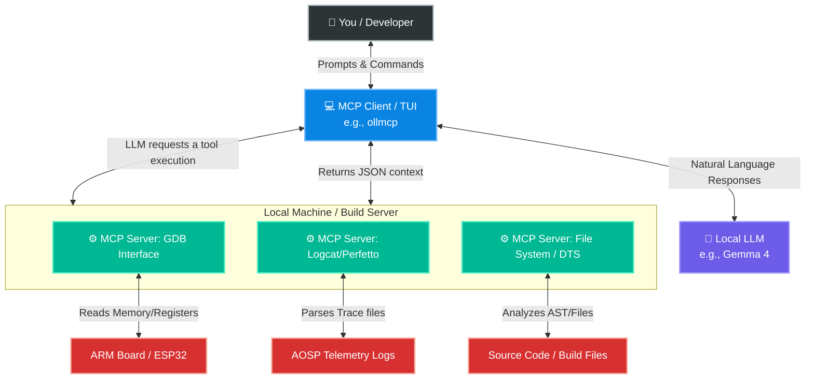

## 1. Generic Architecture of the Model Context Protocol (MCP)

Before looking at how this applies to embedded development, it helps to understand exactly what MCP is and how it functions under the hood.

### What is the Model Context Protocol?
Created by Anthropic, the Model Context Protocol (MCP) is an open, standardized architecture that allows AI models to securely connect to external data sources and tools. Think of it as **USB-C for AI applications**. Instead of writing custom API wrappers for every single AI model (OpenAI, Google, Anthropic, local Ollama), you write one MCP server. Any MCP-compatible AI client can then plug into it.

### How Does it Communicate? (The Transports)
MCP operates on a strict Client-Server model, but it is highly flexible in *how* that communication happens. It primarily uses two transport mechanisms:

1. **`stdio` (Standard Input/Output):** This is what we use most in this repository. The MCP client spawns your Python/Node script as a local background process and communicates with it instantly via terminal input/output. It is perfect for local system tasks like reading files, triggering GDB, or parsing local binaries securely.
2. **SSE (Server-Sent Events over HTTP):** This is used for remote servers. If your hardware lab has a central Jenkins build server, you could run an MCP server there. Your local AI would connect over HTTP/SSE to query remote AOSP build logs without needing to download them to your laptop.

### The Handshake: How Does the LLM Discover Tools?
LLMs do not inherently "know" what is on your computer. Tool discovery happens via an automated handshake when you first start the client:

1. **Initialization:** When `ollmcp` starts, it connects to the MCP servers listed in your `mcp-servers.json` file.
2. **The "Menu" Request:** The client asks each server, *"What tools do you have?"*
3. **The Schema Reply:** The server replies with a JSON schema defining its tools, what they do, and what arguments they require (e.g., `"name": "read_register", "description": "Reads an ARM system register", "args": {"register_name": "string"}`).
4. **Context Loading:** The client injects this "menu" into the LLM's system prompt. Now, the LLM is aware of its capabilities.

### The Invocation Loop: How the AI Decides to Act
Once the AI knows the tools exist, how does it actually use them? Modern LLMs like Gemma 4 or Llama 3 are trained for **Function Calling**. 

1. You ask a question: *"Why did my EL1 interrupt handler crash?"*
2. The LLM analyzes the prompt and realizes it needs more context. Instead of generating English text, it halts and generates a JSON payload requesting a tool: `{"call": "read_dmesg_logs", "lines": 50}`.
3. The `ollmcp` client intercepts this JSON, routes it to the correct MCP server, and waits for the script to run.
4. The MCP server returns the raw log data to the client.
5. The client feeds those logs back to the LLM invisibly.
6. The LLM reads the logs and finally responds to you in plain English with the solution.

## 2. How MCP might apply/look like for Embedded Setup

First, let's back up a bit and see what is the problem with just old-plain LLM model?

### The Problem: The Isolated Brain
Large Language Models (LLMs) like Gemma 4 or Llama 3 are incredibly smart. They have read the Linux kernel source code, they understand ARM assembly, and they know the theoretical steps to debug an AOSP build. 

However, by default, an LLM is like a **world-class master chef locked in an empty kitchen**. 
The chef knows millions of recipes, but if you ask them to bake a cake, they can't—because they have no flour, no eggs, and can't see what temperature your oven is set to. In the developer world, this means the AI doesn't know what your specific `dmesg` logs say, what your hardware registers read, or what your `Android.bp` file looks like.

### The Solution: Model Context Protocol (MCP)
MCP acts as a **universal standard—like USB-C for AI**. It provides a standardized way for the AI model to request "ingredients" from your local machine.

Instead of you manually copying and pasting thousands of lines of hex dumps or logs into a chat window, you provide the AI with **MCP Servers**. These servers act as specialized "sous-chefs." When the AI needs information to solve your problem, it simply asks the appropriate server to fetch it.

### Why This is a Game-Changer for Embedded Systems
1. **Eliminates Hallucinations:** When the AI needs to know the offset of an interrupt vector, it doesn't guess. It uses an MCP tool to read the actual ELF file or memory dump on your machine.
2. **Infinite Context:** AOSP logs and kernel traces are massive and easily break an LLM's context window. With MCP, the AI can execute a tool to *search* or *filter* a 50MB log file and only read the specific 20 lines where the kernel panicked.
3. **Hardware Interactivity:** The AI isn't just reading static files; it can interact with dynamic state. It can ask a GDB MCP server to halt the processor, read a specific register, and explain why your bare-metal Rust bootloader is faulting.

### Architecture Diagram

Below is a high-level view of how data flows in this setup. The Client acts as the central router, passing your questions to the LLM, passing tool requests to the MCP Servers, and returning the raw data back to the AI for analysis.



## 3. Coding Your Own MCP Tools (Using FastMCP)

While the community registry (which we saw in the setup guide) is great, the true power of this setup comes from writing custom tools for your specific hardware lab. 

To do this, we use **FastMCP** (part of the official Python MCP SDK). If you have ever used FastAPI for web development, FastMCP will feel instantly familiar. It handles all the complex JSON-RPC protocol boilerplate behind the scenes, allowing you to turn standard Python functions into AI tools using simple decorators.

One of the Hello World's of MCP server I can think of for an embedded setting might be `a tool that allows the local LLM to read and filter your Linux kernel's dmesg`.

### Step 1: Install the SDK
First, let's ensure we have the official MCP SDK installed in your environment:
```bash
uv pip install mcp
```

### Step 2: The Code Breakdown

Create a file named `dmesg_server.py` (location doesn't matter much at this point). We shall build it piece by piece.

**1. Initialization**
Just like starting a web server, we import the library and initialize our MCP application.

```python
import subprocess
from mcp.server.fastmcp import FastMCP

# Initialize the server with a descriptive name
mcp = FastMCP("KernelLogServer")
```

**2. Defining the Tool (The Magic is in the Docstring)**
To expose a function to the AI, we use the `@mcp.tool()` decorator. 

*Crucial Concept:* The AI relies entirely on Python **Type Hints** and **Docstrings** to understand how to use your tool. You *must* define exactly what the tool does, what the arguments are, and what types they accept. FastMCP automatically parses this docstring into the JSON schema the LLM reads during the "handshake."

```python
@mcp.tool()
def fetch_dmesg(lines: int = 50, filter_term: str = "") -> str:
    """
    Fetches recent Linux kernel ring buffer logs (dmesg).
    Useful for debugging USB devices, driver crashes, and hardware faults.

    Args:
        lines: The number of recent log lines to retrieve (default 50).
        filter_term: An optional keyword to filter the logs (e.g., "usb", "error", "tty").
    """
    try:
        # Run dmesg with human-readable timestamps (-T)
        result = subprocess.run(
            ["dmesg", "-T"], 
            capture_output=True, 
            text=True, 
            check=True
        )
        logs = result.stdout.splitlines()

        # Apply the optional text filter
        if filter_term:
            logs = [line for line in logs if filter_term.lower() in line.lower()]

        # Return the last 'N' lines as a single string
        return "\n".join(logs[-lines:])
    except Exception as e:
        return f"Failed to fetch dmesg logs: {str(e)}"
```

**3. Execution Logic**
Finally, we tell the script how to communicate. Because this is a local tool communicating with the `ollmcp` client on the same machine, we use the `stdio` (Standard Input/Output) transport.

```python
if __name__ == "__main__":
    # Start the server listening on standard input/output
    mcp.run(transport='stdio')
```

### Step 3: Integrating the Custom Tool

Now that your server is written, you just need to tell your MCP Client where it is. Add it to your `mcp-servers.json` file (from Section 7):

```json
{
  "mcpServers": {
    "dmesg_analyzer": {
      "command": "python3",
      "args": [
        "/absolute/path/to/your/dmesg_server.py"
      ]
    }
  }
}
```

### Step 4: Testing it Out

Restart your `ollmcp` client. You can now type a natural language prompt like:

> *"My custom ESP32 board isn't showing up when I plug it via USB. Can you check the kernel logs for any enumeration errors?"*

**What happens next?**
1. The LLM realizes it needs kernel logs.
2. It sees your `fetch_dmesg` tool.
3. It autonomously calls `fetch_dmesg(lines=20, filter_term="usb")`.
4. Your Python script executes `dmesg`, filters the output, and returns the text.
5. The LLM reads the result and tells you exactly why the USB handshake failed (e.g., *"It looks like device descriptor read/64 error, usually indicating a bad cable"*).